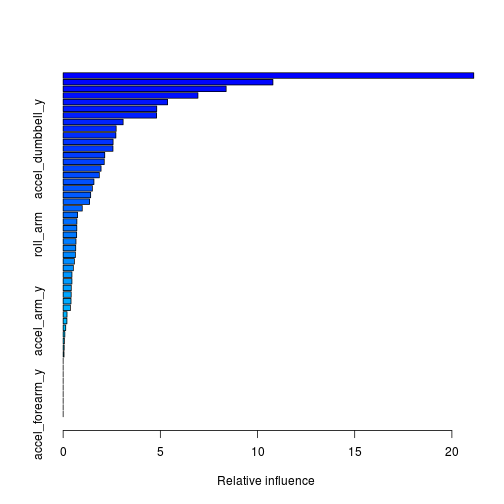
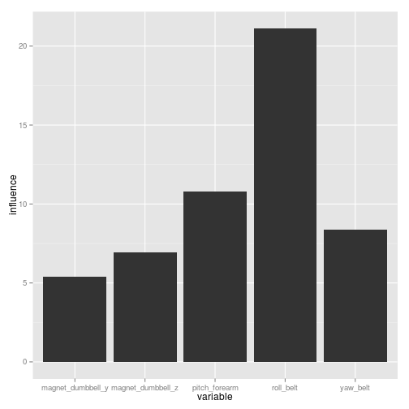
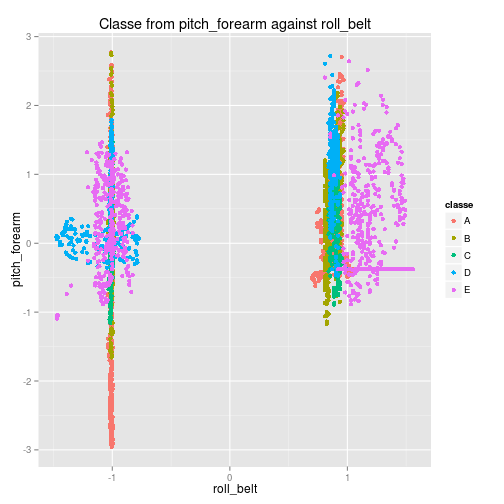

Distinguishing Correct Excercise Technique with the HAR dataset
===============================================================
## Daniel Thomas 2014
This report was written for the Practical Machine Learning Coursera class running July 2014.

In this activity we analyse data from http://groupware.les.inf.puc-rio.br/har which includes measurements from multiple sensors during a specific excercaise.  Each record is marked as to if the excercise technique is correct 'Classe A' or a specific incorrect technique 'Classe B-E'.   We take this data and attempt to constuct a machine learning algorithm which will correctly identify future samples to determine if the technique is correct, or otherwise which error is being made.


### Environment
We start by setting the environment, establishing a fixed seed (for reproducibility) and loading necessary libraries.

```r
library(plyr)
library(dplyr)
```

```
## 
## Attaching package: 'dplyr'
## 
## The following objects are masked from 'package:plyr':
## 
##     arrange, desc, failwith, id, mutate, summarise, summarize
## 
## The following objects are masked from 'package:stats':
## 
##     filter, lag
## 
## The following objects are masked from 'package:base':
## 
##     intersect, setdiff, setequal, union
```

```r
library(caret)
```

```
## Loading required package: lattice
## Loading required package: ggplot2
```

```r
set.seed(12321)
```
### Data load and cleanse
Data is loaded from the training file and the following transformations are made
* records with new_window == "yes" are discarded as these contain summary data which is not useful for this excercise
* columns beginning with stddev, var, avg, max, min, amplitude, kurtosis and skewness are discarded. These only have a value for new_window=="yes" records, so are not value adding here.
* Columns X, username, timestamps (all three), new_window & num_window are discarded
* the 'classe' column is converted to a factor.

```r
allData<-read.csv(file="data//pml-training.csv",na.strings = "NA",stringsAsFactors=F)

#drop all new_window rows
allData<-allData %>% filter(new_window!="yes")
allData<-allData %>% select(-starts_with('stddev_'),-starts_with('var_'),-starts_with('avg_'),-starts_with('min_'),-starts_with('amplitude_'),-starts_with('max_'),-starts_with('kurtosis'),-starts_with('skewness'))

allData<-allData %>% select(-X,-user_name,-starts_with('raw_timestamp_part'),-cvtd_timestamp,-new_window,-num_window)

#convert classe to a factor

allData<-allData %>% mutate(classe=as.factor(classe))
```

### Data normalisation
All data is normalised to a mean of 0 and sd of 1.

```r
normalise<-function(x){;m<-mean(x);s<-sd(x);x<-(x-m)/s;x}
for (x in seq(1,dim(allData)[2]-1)) {allData[,x]<-normalise(allData[,x])}
```
### Training and Validation DataSets
After the initial transformations, data is split into a training and cross validation set, such that around 70% of records are avaialable for training, with the remainder used for checking for validation testing.


```r
inTrain<-createDataPartition(allData$classe,p=0.7,list=F)
training<-allData[inTrain,]
cvTrain<-allData[-inTrain,]
```

### Model building
Now we create a model from the training data set with the 'GBM' method.   Once the model is built we print the confusion matrix to show the level of accuracy obtained. 

```r
mod<-train(classe ~. ,data=training,method="gbm",verbose=F)
```

```
## Loading required package: gbm
## Loading required package: survival
## Loading required package: splines
## 
## Attaching package: 'survival'
## 
## The following object is masked from 'package:caret':
## 
##     cluster
## 
## Loading required package: parallel
## Loaded gbm 2.1
```

```r
predTrain<-predict(mod,training)
confusionMatrix(training$classe,predTrain)
```

```
## Confusion Matrix and Statistics
## 
##           Reference
## Prediction    A    B    C    D    E
##          A 3793   23   13    0    1
##          B   59 2491   50    3    0
##          C    0   60 2266   19    2
##          D    0    3   54 2141    5
##          E    2   12   16   19 2421
## 
## Overall Statistics
##                                         
##                Accuracy : 0.975         
##                  95% CI : (0.972, 0.977)
##     No Information Rate : 0.286         
##     P-Value [Acc > NIR] : <2e-16        
##                                         
##                   Kappa : 0.968         
##  Mcnemar's Test P-Value : NA            
## 
## Statistics by Class:
## 
##                      Class: A Class: B Class: C Class: D Class: E
## Sensitivity             0.984    0.962    0.945    0.981    0.997
## Specificity             0.996    0.990    0.993    0.994    0.996
## Pos Pred Value          0.990    0.957    0.965    0.972    0.980
## Neg Pred Value          0.994    0.991    0.988    0.996    0.999
## Prevalence              0.286    0.192    0.178    0.162    0.181
## Detection Rate          0.282    0.185    0.168    0.159    0.180
## Detection Prevalence    0.285    0.193    0.174    0.164    0.184
## Balanced Accuracy       0.990    0.976    0.969    0.988    0.996
```
As can be seen with the training set an accuracy of **97.6%** was obtained, leaving an error rate of **2.4%**, the 95% confidence interval is 97.3% to 97.8% 

### Model Validation
Our model is now validated against the data kept aside for validation and the confusion matrix supplied below.

```r
predTest<-predict(mod,cvTrain)
confusionMatrix(cvTrain$classe,predTest)
```

```
## Confusion Matrix and Statistics
## 
##           Reference
## Prediction    A    B    C    D    E
##          A 1612   20    7    2    0
##          B   23 1066   23    2    1
##          C    0   29  958   17    1
##          D    4    1   25  911    3
##          E    2   12    9   14 1021
## 
## Overall Statistics
##                                         
##                Accuracy : 0.966         
##                  95% CI : (0.961, 0.971)
##     No Information Rate : 0.285         
##     P-Value [Acc > NIR] : < 2e-16       
##                                         
##                   Kappa : 0.957         
##  Mcnemar's Test P-Value : 0.000113      
## 
## Statistics by Class:
## 
##                      Class: A Class: B Class: C Class: D Class: E
## Sensitivity             0.982    0.945    0.937    0.963    0.995
## Specificity             0.993    0.989    0.990    0.993    0.992
## Pos Pred Value          0.982    0.956    0.953    0.965    0.965
## Neg Pred Value          0.993    0.987    0.987    0.993    0.999
## Prevalence              0.285    0.196    0.177    0.164    0.178
## Detection Rate          0.280    0.185    0.166    0.158    0.177
## Detection Prevalence    0.285    0.193    0.174    0.164    0.184
## Balanced Accuracy       0.988    0.967    0.964    0.978    0.994
```

This shows an accuracy of **96.5%**, or an error rate of **3.5%** which can be expected to be similar to new sample data as the validation data was not used in construction of the model.   The 95% Confidence Interval for the validation test is 96% to 97%.   This is a very good result, so some confidence can be placed on predictions made using this model.

### Model Analysis
Finally we analyse the model and investigate the significant parameters, it is interesting to note that 50% of the relative influence in the model comes from only 5 of ~50 variables, as shown in the second graph below:

```r
s<-summary(mod)
```

 

```r
chart<-data.frame(variable=s$var[seq(1,5)],influence=s$rel.inf[seq(1,5)])
qplot(x=variable,y=influence,data=chart,geom="bar", stat="identity")
```

 
From this we can show the impacts of key variables on the outcome, such as this which shows groupings for particular error types

```r
qplot(x=roll_belt,y=pitch_forearm,color=classe,data=cvTrain,main="Classe from pitch_forearm against roll_belt")
```

 
